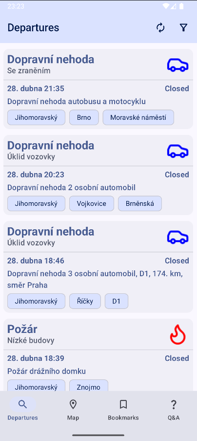
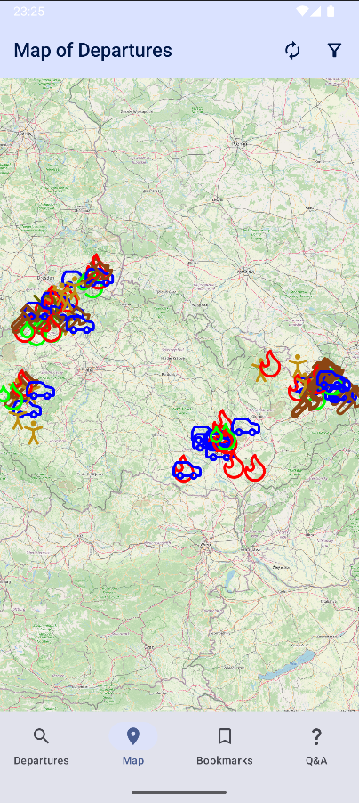
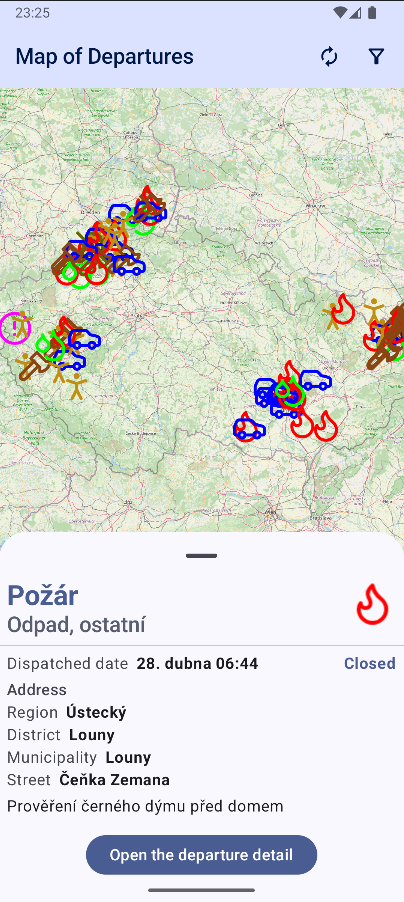
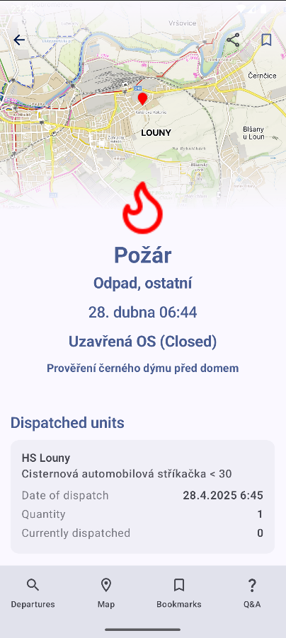
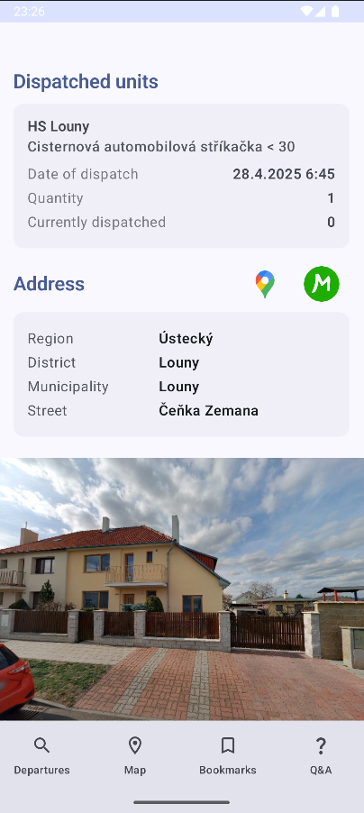
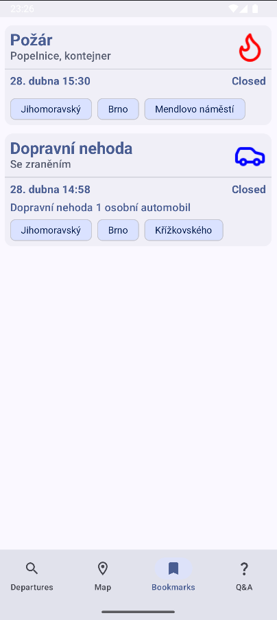
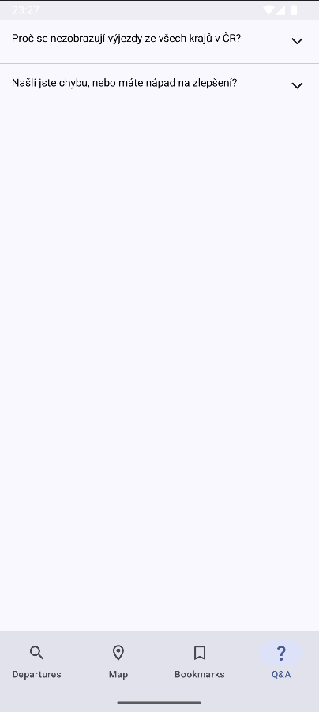

# Fire and rescue departures

This is a simple Android app that displays fire and rescue departures in the Czech Republic. Not all
regions are available since there is no centralized API for this data.

## Regions

This is the list of regions supported regions, but not all of them are available:

- [Jihomoravský](https://udalosti.firebrno.cz)
- [Královéhradecký](https://udalostikhk.hzscr.cz)
- [Moravskoslezský](http://webohled.hzsmsk.cz)
- [Plzeňský](https://zasahy.hzspk.cz)
- [Ústecký](https://udalosti.hzsulk.cz)
- [Vysočina](https://webohled.hasici-vysocina.cz/udalosti)
- [Zlínský](https://webohledzlk.hzscr.cz/udalosti)

## Download

The app can be downloaded
from [latest release](https://github.com/ingui-n/fire-and-rescue-departures/releases/latest) in
Czech or partially translated in English.

## Setup

1. Clone the repository
2. Copy `local.properties.template` to `local.properties`
3. Fill in the `MAPS_COM_API` property with
   your [Mapy.com](https://developer.mapy.cz/rest-api/jak-zacit/) API key
4. Build the project

## Screenshots

